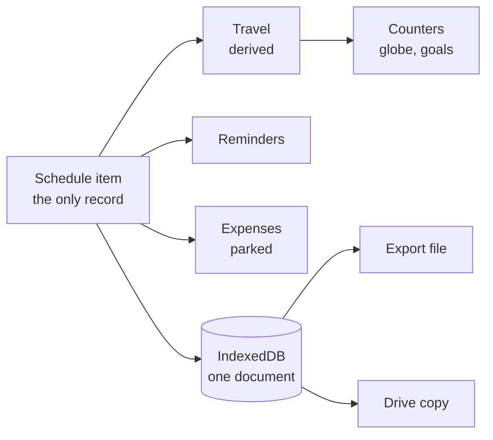
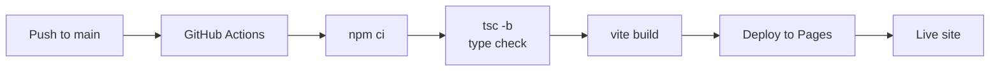

# SchedulePlan — Project Proposal

A personal schedule, travel and expense notebook that works offline, keeps its data on the device, and needs no account.

2026-09-22 · K

## Summary

SchedulePlan is built, deployed and in daily use. This proposal documents what exists, why it was built the way it was, and asks for agreement on the next three phases.

It is a personal notebook for a trip: what you are doing, where you have been, what you spent, what the rate is, and what the menu says. Seven phases plus a Travel module have shipped. It runs at [kaonhew02.github.io/SchedulePlan](https://kaonhew02.github.io/SchedulePlan/), costs nothing to host, and has no server, no account and no sign-up.

|  |  |
| --- | --- |
| Status | Shipped and in use; version 0.2 |
| Live at | [kaonhew02.github.io/SchedulePlan](https://kaonhew02.github.io/SchedulePlan/) |
| Modules live | Schedule, Travel, Reminders, Currency, Translate, More |
| Module parked | Expenses, behind a one-word flag |
| Users | One, by design |
| Running cost | Nothing |
| Stack | React 19, TypeScript, Vite 6, Tailwind 3 |
| Bundle | 418 KB, 128 KB over the wire |
| Data | Stays in the browser; nothing is sent anywhere |

The ask is threefold: keep the no-account, no-server constraint as a permanent rule rather than a starting point; approve the next three phases in the order set out under Roadmap; and accept the single-device storage risk as stated, mitigated by export and the Drive copy rather than solved by a backend.

## The problem

A trip gets split across four apps that do not know about each other, and the useful questions fall into the gaps between them.

The calendar holds the flight. A spreadsheet holds what it cost. A currency app holds the rate on the day. A notes app holds the booking reference and the photo of the hotel confirmation. Each is fine on its own. None of them can answer "what did Vietnam cost", because the flight is in one, the dinners are in another, and nothing links either to the word *Vietnam*.

The specific failures that shaped this project:

- **The same thing gets typed twice.** A trip is entered in the calendar, then again in the expense sheet so the spending has something to hang off. The second copy drifts from the first, and the drift is invisible.
- **A rate that moves rewrites history.** An expense app that stores a foreign amount and converts it live restates last week's dinner every time the rate moves. What the dinner cost is a fact about last week, not about today.
- **An account is a poor trade for a notebook.** Most of these apps want a sign-up, then a subscription, to hold data that is only ever read by one person on one phone.
- **Abroad is exactly where the network is worst.** Roaming is off, the hotel wifi is a captive portal, and the app that needs to reach a server to show you your own itinerary shows you nothing.
- **Nobody counts their own trips.** "How many countries have I been to" has an answer sitting in the calendar already, and no calendar will tell you.

## Who it is for

One person, deliberately. Every design decision below follows from refusing to generalise past that.

The user is a frequent short-haul traveller in South East Asia — Malaysia, Singapore, Indonesia, Vietnam — taking trips of a few days to a couple of weeks, often with several stops inside one journey. The trip that shaped the design was Vietnam: Da Nang, then Hoi An, then Da Nang again, which is one journey and three rows in any ordinary calendar.

That single-user constraint buys a great deal:

- No accounts, so no auth, no password reset, no session handling, no privacy policy.
- No server, so no backend, no database, no hosting bill, no uptime obligation.
- No sync conflicts, because there is one writer.
- No permissions model, no sharing, no roles.
- Decisions can be opinionated. Where a product for everybody has a setting, this has a rule.

The cost is equally clear and is stated plainly under Risks: the notebook lives in one browser on one device, and getting it somewhere else is a deliberate act rather than something that happens by itself.

## What it does

Six modules are on the navigation bar; everything else lives behind **More**.

| Module | What it is for | Notable detail |
| --- | --- | --- |
| Schedule | Day, week and month views of what is happening | Opens on the month, not today. An item can be whole-day and span dates, which is what a trip actually is |
| Travel | Where you have been, counted; where you are going | Every figure is derived from the schedule. There is no Trip record anywhere |
| Reminders | Due date and time, optionally running until a later one | Can repeat daily or weekly inside that window |
| Currency | Converter over a keyless public rate feed | Cached for the day, so it works on a plane. The rate is overridable by hand |
| Translate | The moment in front of somebody where the words are not there | 48 languages, two keyless translators tried in order, everything saved |
| More | Scanner, labels, home currency, backup and restore | Where things live before they earn a tab |

### Schedule

The app opens on the month rather than today, because the day you are in is the thing you already know. Tapping a date drops into the day. Items carry tags, a location, links, notes and attachments. A spanning item appears on every day it covers and says which day of it you are looking at — *Day 2/5*.

### Travel

The module that justifies the architecture. It counts countries, destinations and continents off the schedule, shows two goals (50 countries, 100 places), draws a globe with every country visited filled in, lists each trip with what it cost, and holds a wishlist of where to go next.

Nothing on the screen except the wishlist is stored. A trip is a schedule item that spans days, carries a country and is tagged Travel. Add a country to something already in the diary and it appears here — nothing is entered twice.

The globe fetches real border geometry on demand rather than carrying it in the bundle. Tap a country badge and it turns to face that country and closes in far enough to see it. The eighteen countries too small for the map file to draw — Singapore, Bahrain, Malta, the Maldives — get a marked dot instead, because a globe that looks untouched after a trip is worse than one with a mark in the wrong style.

### Currency

Everything is quoted in the currency's **own lot** — a million dong, a thousand yen, a hundred baht, one pound — which is how the board behind the counter quotes it. The number on the wall and the number on the screen are then the same shape and can simply be compared.

Boards do not agree with each other; plenty of changers price yen by the hundred rather than the thousand. So the lot is tappable: pick the one in front of you, and it sticks per currency and re-quotes the screen.

### Translate

Forty-eight languages, with the nine a trip from here actually uses at the top. Three things to do with an answer: **say it** through the phone's own voice, **show it** at a size readable across a food stall, and keep it. Everything translated is written into the notebook, because a border queue, a market and a bus have the worst signal, and the second time you need a phrase there should be no request at all.

Where the device has no voice for a language, the app says so rather than handing the text to an English one — which sounds like it worked and is not.

### More

A document scanner that reads a booking into the schedule with no account and no API key, editors for tags and categories, the home currency setting, and the backup tools — export, import, and the Google Drive copy.

## The rules the app is built on

Five rules. They are what make the modules cohere rather than sit side by side, and every one of them has cost something to keep.

**1. The schedule item is the only top-level object.** There is no Trip record, no Journey, no Itinerary. A trip is a schedule item that spans days, carries a country and is tagged Travel. Travel is a way of looking at the items that happen to be somewhere.

The consequence is that adding a country to something already in the diary makes it a trip. Nothing is entered twice, and the spend already attached to that item comes with it.

**2. Everything derivable is derived.** Counters, the globe, the goals and the trip list are all computed from the schedule on each render. Nothing is a stored total, so nothing can be stale. When the place-counting rule changed, every historical figure changed with it — no migration, no backfill.

**3. A rate is frozen at the moment it applied.** A foreign amount keeps the original figure, the currency and the rate as at the moment it was saved. What a dinner cost is a fact about the night of the dinner, and no later market move restates it.

**4. No account, no server, ever.** Not a starting constraint to be relaxed later — a permanent rule, and the first thing this proposal asks to have agreed. It is what makes the app work with roaming off, what keeps the running cost at zero, and what means there is no privacy policy to write because there is nothing to have a policy about.

**5. Legs, so one journey is one row.** Da Nang, then Hoi An, then Da Nang again is one journey. Items can be joined to a parent, and Travel lists the parent while the counters read every leg. Counting the list rather than the legs would quietly lose a destination the moment two rows were joined.

## Status

All seven planned phases have shipped, plus Travel, which was not in the original plan. The app is version 0.2 and in daily use.

| Area | Status | Notes |
| --- | --- | --- |
| Schedule | Shipped | Day, week, month; whole-day and multi-day items; tags, links, notes, attachments |
| Travel | Shipped | Counters, two goals, interactive globe, trip pages, wishlist |
| Reminders | Shipped | Windowed and repeating; alerts fire only while a tab is open |
| Currency | Shipped | Keyless feed, cached daily, per-currency lots, manual override |
| Translate | Shipped | 48 languages, two keyless providers, speak and show, everything saved |
| Document scanner | Shipped | In-browser OCR, no account, no API key |
| Backup and restore | Shipped | Export, import, and a Google Drive copy |
| Expenses | Parked | Built and working; switched off at the user's request |
| Bill split | Parked | Part of Expenses |
| Receipt scanner | Parked | Part of Expenses |

### On the parked module

Expenses is finished code, not unfinished work. It was switched off on 22 September 2026 because the user wanted the money side out of the way, not because anything was wrong with it.

It is off behind a single constant, `MONEY` in `lib/features.ts`. That covers the tab, the bill split, the receipt scanner, the add-expense button and spend line on a schedule item, the cost of a trip in Travel and on a trip page, and the expense categories editor in More. Currency is deliberately not included — a rate is worth looking up whether or not anything is being tracked.

The flag is read at each call site rather than the code being commented out, which keeps everything behind it compiled and type-checked. Commented-out code drops out of the type checker's sight and quietly stops being code that would work. Vite still removes it from the build: **460 KB to 418 KB**, the whole module leaving.

No recorded data is touched. The storage layer does not know the flag exists, so expenses and splits already saved are still read, written, exported and backed up. One word brings the whole module back.

## Architecture and technology

A static single-page app with six runtime dependencies and no backend of any kind.

| Piece | Choice | Why |
| --- | --- | --- |
| Framework | React 19 | Derived views re-compute on render, which is rule 2 made cheap |
| Language | TypeScript 5.7 | The counting rules are the product; a wrong type there is a wrong number |
| Build | Vite 6 | Dynamic imports become separate assets without configuration |
| Styling | Tailwind 3.4 | No stylesheet to keep in step with the markup |
| Storage | IndexedDB | Survives a reload; holds file attachments, which localStorage cannot |
| Map geometry | d3-geo + topojson-client + world-atlas | Orthographic projection and 110m borders, fetched on demand |
| OCR | tesseract.js | Reads a booking in the browser, so no document leaves the device |

There is no router, no state library and no component library. Screens are switched by a single piece of component state; the store is about 900 lines of plain TypeScript over IndexedDB with a subscription hook.

### Data flow

### Bundle

The whole app is **418 KB, 128 KB gzipped**, and the heavy parts are not in it.

| Asset | Size | Loaded |
| --- | --- | --- |
| Main bundle | 418 KB | On open |
| Stylesheet | 36 KB | On open |
| Map geometry | 108 KB | First time Travel opens |
| d3-geo + topojson | 37 KB | First time Travel opens |
| OCR engine | Several MB, from a CDN | Only when a scan is started |

The rule behind that table: a cost belongs to the screen that incurs it. Schedule is opened every day and loads none of the map, none of the projection library and none of the OCR engine. Travel pays for the map the first time it is opened, once per session. This is enforced by dynamic imports, and the map is emitted as its own asset rather than inlined.

## Data, privacy and storage

The notebook is one JSON document in the browser's IndexedDB. It is never sent anywhere unless the user explicitly exports it or turns on the Drive copy.

The document holds the schedule, expenses, tags, categories, reminders, bill splits, the wishlist, saved phrases and settings. Attachments are stored as files alongside it, which is why IndexedDB rather than localStorage — a photo of a hotel confirmation will not fit in the latter.

### What leaves the device

| Traffic | When | What is sent |
| --- | --- | --- |
| Rate feed | First currency lookup each day | The currency pair. No user data |
| Translation | On translating a phrase | The phrase itself, to one of two keyless providers |
| Map geometry | First time Travel opens | Nothing; a static file is fetched |
| OCR engine | First scan | Nothing; the engine is fetched and runs locally |
| Drive copy | Only if switched on | The whole notebook, to the user's own Drive |

No analytics, no telemetry, no crash reporting, no fonts from a third party, no advertising or tracking of any kind. There is no account to attach behaviour to.

The one genuine disclosure: translating a phrase sends that phrase to a public translation service. This is unavoidable for the feature to exist, and it is the reason translations are cached — the second time a phrase is needed there is no request at all.

### Three ways out

1. **Export** writes the whole notebook to a file, byte-exact. Dated copies are kept in the repository under `backups/`, and a git attribute stops line-ending conversion from changing their hashes.
2. **Import** reads one back. It is defensive about older files: every field absent from a backup written before a feature existed is filled with a default rather than failing.
3. **The Drive copy** pushes the same document to the user's own Google Drive, on demand or automatically.

The app was originally on localStorage and migrated to IndexedDB. The migration still runs on first load, and the old copy is deliberately left in place — it costs a few kilobytes and is the only way back if the migration got something wrong.

## Build, hosting and delivery

A push to `main` deploys. There is no staging environment, no release process and no deployment cost.

The workflow is `.github/workflows/pages.yml`: checkout, Node 20, `npm ci`, `npm run build`, upload, deploy. The build is `tsc -b && vite build`, so **a type error fails the deploy** — that type check is the whole of the automated safety net, which is an honest statement of where this project's quality assurance currently sits. See Risks.

|  |  |
| --- | --- |
| Repository | [github.com/KaonHew02/SchedulePlan](https://github.com/KaonHew02/SchedulePlan) |
| Live site | [kaonhew02.github.io/SchedulePlan](https://kaonhew02.github.io/SchedulePlan/) |
| Trigger | Push to `main`, or manual dispatch |
| Build time | Under 5 seconds locally; about a minute on CI |
| Concurrency | One deploy at a time, newer cancels older |
| Rollback | Revert the commit and push |

Development is `npm install` then `npm run dev`, served at `http://localhost:5173/SchedulePlan/` — the base path matters, because it is the one the deployed site uses.

One operational note worth recording: the site is served from a path, not a domain root, so anything that assumes `/` will break in production and work perfectly in development.

## Scope

What is out matters more than what is in, because the exclusions are what keep the app buildable by one person and free to run.

### In

The six live modules, the document scanner, backup and restore, and the Drive copy. All shipped.

### Parked

Expenses, the bill split and the receipt scanner — finished code behind `MONEY = false`. Reversible in one word, with no data loss. Detail under Status.

### Out, and staying out

| Not doing | Why |
| --- | --- |
| Accounts and sign-in | Rule 4. Nothing to sign in to, so nothing to breach, reset or pay for |
| A backend | Same. It would add the only recurring cost the project has |
| Multi-user or sharing | One writer is what removes sync conflicts and a permissions model |
| Push notifications | They need a server. Reminders fire while a tab is open, and the screen says so rather than implying otherwise |
| Native iOS or Android apps | Two more toolchains and two store review processes for a web app that already works offline |
| Real-time sync across devices | Export and the Drive copy cover the need at a fraction of the complexity |
| Paid map or translation APIs | Both features work keyless today. A key means a bill and a secret to keep out of a static site |
| Collaborative trip planning | A different product |

The honest tension in that list is the push-notification row: a reminder that only fires while a tab is open is a weak reminder. It is accepted rather than solved, and the screen is explicit about the limitation instead of letting the user discover it by missing something.

## Roadmap

Eight phases are delivered. Three are proposed, in this order, and the order is the point: the safety net comes before new features.

### Delivered

| Phase | What it added |
| --- | --- |
| 1 | Schedule — day, week, month; whole-day and multi-day items |
| 2 | Reminders — windowed and repeating |
| 3 | Expenses — multi-currency with frozen rates *(now parked)* |
| 4 | Currency — keyless feed, daily cache, per-currency lots |
| 5 | Bill split — by what each person had *(now parked)* |
| 6 | Scanners — receipt and booking, in-browser OCR |
| 7 | Translate — 48 languages, speak and show, everything saved |
| 8 | Travel — counters, goals, globe, trip pages, wishlist |

### Proposed next

**Phase 9 — A test suite.** The largest gap in the project and the reason it is first. There is currently no automated test of any kind; the type checker in CI is the entire safety net. Three bugs in the last week were caught by a person looking at the screen, and one of them — a marker painted off the edge of its own clip region — had been live for an unknown length of time without anyone noticing.

The counting rules are where this bites hardest. What makes two cities the same city, whether a country-only visit is a place, how legs roll into a trip: these are pure functions over plain data, they are the product, and they are perfectly testable. Proposed: Vitest, unit tests over the counting and date rules first, then the store's import and migration paths.

**Phase 10 — Offline as a guarantee.** The app is offline-capable by accident — nothing needs a server — but the *page itself* still has to be fetched. A service worker and a web app manifest would make it installable and genuinely openable with no connection, which is the stated use case. It also opens the door to reconsidering push notifications.

**Phase 11 — Decide Expenses.** The module is parked, not cancelled. At some point it should either come back on or be removed. A flag left indefinitely becomes a second version of the app that nobody is testing.

### Deliberately unscheduled

Bringing Expenses back, splitting Travel's wishlist into its own module, and a second theme are all possible and none are queued. The project has no deadline and no external commitment, which is a luxury worth stating rather than quietly spending.

## Risks

The two that matter are data loss and the absent test suite. The rest are minor and already handled.

| Risk | Severity | Handling |
| --- | --- | --- |
| Notebook lost with browser data | **High** | Export to a file, dated copies in the repository, and the Drive copy. All manual acts — see below |
| No automated tests | **High** | Type checking in CI. Phase 9 addresses it directly |
| Rate feed disappears or changes | Medium | Cached for the day, so a failure is not immediate. Rates are overridable by hand, which is the real fallback |
| Translation providers withdraw | Medium | Two are tried in order and the screen says which answered. Everything translated is saved, so the phrasebook survives losing both |
| OCR misreads a booking | Low | Output is a draft the user edits before saving, never written directly |
| Bus factor of one | Medium | The repository is public and the reasoning is written down in the code, at length |
| Browser drops IndexedDB under pressure | Medium | Same handling as the first row. The app also works for a session when the database is refused, and says so |

### On data loss

This is the real exposure and the proposal does not pretend otherwise. The notebook is in one browser on one device. Clear site data, lose the device, or have the browser evict storage under pressure, and it is gone unless a copy was made.

The mitigations are all *manual*: somebody has to press export, or switch the Drive copy on. Accepting this risk is one of the three things this proposal asks for, because solving it properly means a server, and a server breaks rule 4.

The recommended practice, then, is behavioural rather than technical: switch the Drive copy on, and export before any browser maintenance.

### On the missing tests

Worth stating plainly, because the last week is evidence. Three defects were found by a person looking at the screen rather than by any check:

1. A country marker was rendered into the page, correctly positioned, and painted nowhere — clipped off the corner of its own viewBox. The dot feature for eighteen countries had silently never worked.
2. A trip counted as a place in its own right, so a journey with two stops reported three, and every multi-stop trip was one ahead of itself.
3. Two spellings of one town counted twice.

All three were in pure functions or in markup with no behaviour — exactly what a test suite catches cheaply. That is the argument for Phase 9 going first.

## Cost

Nothing, and that is a design outcome rather than an accident.

| Item | Cost | Note |
| --- | --- | --- |
| Hosting | Free | GitHub Pages, public repository |
| CI | Free | GitHub Actions, public repository |
| Domain | None | Served from `github.io` |
| Rate feed | Free | Keyless public endpoint |
| Translation | Free | Two keyless providers |
| OCR | Free | Runs in the browser |
| Map data | Free | `world-atlas`, an npm package, self-hosted as a static asset |
| Storage | Free | The user's own browser, and optionally their own Drive |
| Licences | None | All dependencies permissively licensed |

Every one of those zeroes traces back to a scope decision. No accounts means no identity provider. No backend means no host. Keyless services mean no billing account and no secret that a public static site would have nowhere safe to keep.

The only real cost is time, and the only recurring obligation is dependency updates — six runtime packages, so a small surface.

## How success is measured

There is one user, so adoption metrics are meaningless. The tests that matter are about whether the thing gets carried on a trip and trusted when it is.

1. **It opens with no signal.** On a plane, in a border queue, with roaming off, the schedule and the saved phrases are there. This is the founding requirement and is met today, with the caveat that the page itself must already have been loaded — Phase 10 closes that.
2. **Nothing is entered twice.** Adding a country to a diary entry makes it a trip. If a future feature requires the same fact typed in two places, the design is wrong.
3. **The numbers are right.** The counters are the product. A wrong destination count is worse than a missing feature, because it is believed. Three counting defects surfaced in the last week is the current honest score.
4. **A trip can be reconstructed afterwards.** Where you went, when, what it cost, what the rate was, and the booking. Currently true, with spending hidden while Expenses is parked.
5. **It survives a device.** Export, import and the Drive copy work, and a backup written before a feature existed still restores. Tested by the dated copies in the repository, which restore cleanly.

The measure this proposal would add: **no user-visible counting defect in a release**, once Phase 9 lands. That is the only one of these with a number attached, and it is currently not being met.

## Appendix: repository map

About 15,100 lines of TypeScript and TSX across 66 source files, organised by module rather than by file type.

| Folder | Files | Holds |
| --- | --- | --- |
| `src/components/` | 23 | Shared UI — navigation, sheets, pickers, badges, the logo, backup bar |
| `src/lib/` | 17 | The rules: store, dates, places and projection, currency, split maths, OCR, translation, Drive, feature flags |
| `src/schedule/` | 8 | Month, week and day views, the item form and detail sheet |
| `src/travel/` | 5 | Travel screen, trip page, the globe, the world map loader, wish form |
| `src/expenses/` | 5 | Expenses screen, form, detail, receipt scan, bill splits *(parked)* |
| `src/reminders/` | 2 | Reminders screen and form |
| `src/screens/` | 2 | Schedule and More — the two top-level screens not in a module folder |
| `src/tools/` | 2 | Document scanner and the labels editor |
| `src/currency/` | 1 | The converter |
| `src/translate/` | 1 | The translator |

### Files worth knowing

| File | Why it matters |
| --- | --- |
| `src/lib/store.ts` | The whole persistence layer. Every read and write of the notebook goes through it |
| `src/lib/places.ts` | The country table, the orthographic projection, and what makes two cities the same city |
| `src/lib/features.ts` | The flags. `MONEY` is here |
| `src/travel/worldmap.ts` | Fetches and prepares the border geometry, including how far to zoom for each country |
| `src/types.ts` | Every record shape in the notebook |
| `.github/workflows/pages.yml` | The entire deployment |
| `backups/` | Dated byte-exact exports, kept out of line-ending conversion by a git attribute |
| `README.md` | 27 KB of reasoning. The closest thing the project has to a design record |

### A note on the comments

The code carries unusually long explanatory comments, and they are deliberate. They record *why* a thing is the way it is — what was tried first, what broke, and what the alternative cost. For a project with one maintainer and no test suite, that reasoning is the main defence against a future change quietly undoing a past decision. It is also what made the three recent defects diagnosable in minutes rather than hours.
