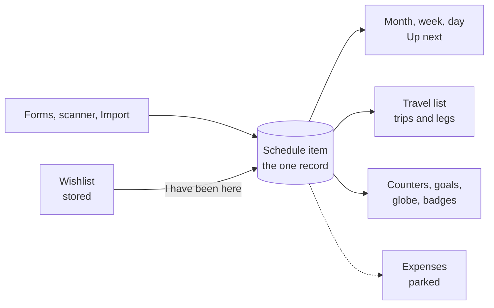
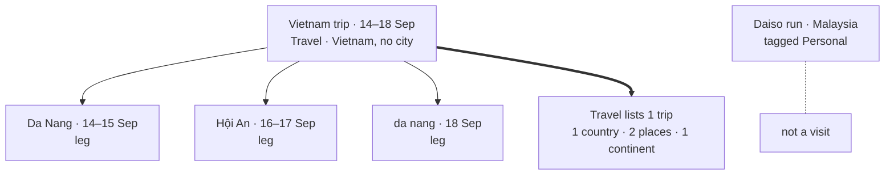
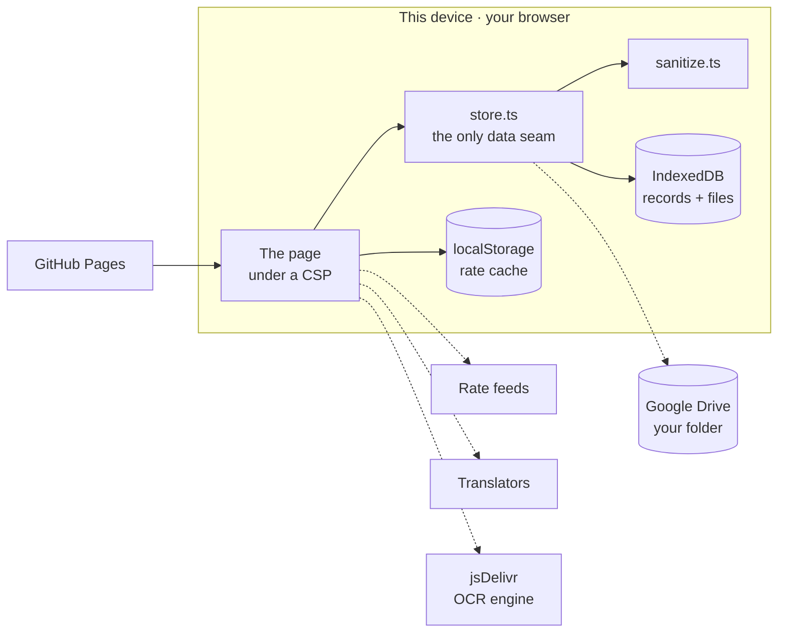
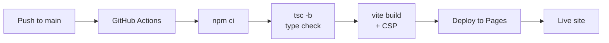

# SchedulePlan — Project Proposal

**Personal Schedule & Travel Notebook**

23 September 2026 · Kaon · Revision 2

*A formatted edition of this proposal, with a cover page, contents and diagrams, sits beside it as [SchedulePlan-Project-Proposal.docx](SchedulePlan-Project-Proposal.docx) and [SchedulePlan-Project-Proposal.pdf](SchedulePlan-Project-Proposal.pdf). This Markdown file is the source; the two are generated from it.*

## Executive summary

SchedulePlan — short form **S.P** — is a browser-based notebook for one person's days and travels: what is on, what comes back every Friday, where you have been, what the rate is at the counter, and what to say to the person behind it. It has no server, no account and no monthly fee. A working build is live at [kaonhew02.github.io/SchedulePlan](https://kaonhew02.github.io/SchedulePlan/): six tabs, five modules and a set of tools behind the sixth, and one module parked behind a flag. That is roughly 16,300 lines of TypeScript across 74 source files, built by Vite and published by GitHub Pages on every push. As of 23 September 2026 the built page also runs under a Content Security Policy, and it treats every file it is handed as a stranger's until each field has been checked.

The product exists because a trip gets scattered across four apps that do not know about each other: a calendar, a spreadsheet, a currency app and a notes app. Every useful question about the trip falls into the gaps between them. In SchedulePlan a trip is not a fifth thing to keep up to date. It is a schedule item with a country on it, and everything the Travel screen shows is counted from the diary.

|  |  |
| --- | --- |
| Product | SchedulePlan (S.P) — *A clean digital notebook for your schedule and your trips* |
| Category | Personal organiser: calendar, travel log and travel toolkit in one notebook |
| Primary user | One frequent short-haul traveller based in Malaysia, travelling South East Asia |
| Delivered | Schedule, Travel, Reminders, Currency, Translate, and More (scanner, labels, backup); version 0.2 |
| Parked | Expenses, Bill split and Receipt scan: finished and working, switched off by one flag |
| Stack | React 19 · TypeScript 5.7 · Vite 6 · Tailwind 3.4 · IndexedDB · GitHub Pages |
| Security | Content Security Policy on the built page · every imported file sanitised · no source maps |
| Dependencies | Six runtime packages, no API keys, no backend, no analytics |
| Running cost | RM 0 a month, because hosting, storage and every service it calls are free or the user's own |
| Effort to date | 55 commits, 10 – 23 September 2026 |
| Proposed next phase | 8 weeks: a test suite that gates the deploy, a true offline start, a backup nudge, and a decision on Expenses |

**The ask.** Approval to run the eight-week plan for Phases 9–11 in [Project plan and timeline](#project-plan-and-timeline), resourced as set out in [Resources and budget](#resources-and-budget): one part-time developer (about 80 hours) and RM 0 of infrastructure. This proposal also asks for three standing decisions: no account and no server, ever; the single-device storage risk accepted as stated; and Expenses decided one way or the other rather than left parked indefinitely.

## Background and problem statement

A trip gets split across four apps, and the useful questions fall into the gaps between them.

The calendar holds the flight. A spreadsheet holds what it cost. A currency app holds the rate on the day. A notes app holds the booking reference and the photo of the hotel confirmation. Each is fine on its own, but none of them can answer "what did Vietnam cost", because the flight is in one app, the dinners are in another, and nothing links either of them to the word *Vietnam*.

These specific failures shaped the project:

- **The same thing gets typed twice.** A trip is entered in the calendar, then again in a travel app or an expense sheet so there is something to hang it on. The second copy drifts from the first, and the drift is invisible.
- **A rate that moves rewrites history.** An app that stores a foreign amount and converts it live restates last week's dinner every time the rate moves. What the dinner cost is a fact about last week, not about today.
- **An account is a poor trade for a notebook.** Most of these apps want a sign-up, then a subscription, to hold data that only ever gets read by one person on one phone.
- **Abroad is where the network is worst.** Roaming is off, the hotel wifi is a captive portal, and an app that needs a server to show you your own itinerary shows you nothing.
- **Nobody counts their own trips.** The answer to "how many countries have I been to" is already sitting in the calendar, and no calendar will give it to you.

### How the project got here

SchedulePlan started on 10 September 2026 as a FastAPI and SQLite app with a day, week and month schedule. The same day it became clear that GitHub Pages cannot run Python and has no disk to write to, and that committing a database to a public repository would publish every appointment in it. The app was rebuilt that afternoon as a static site with the data in the browser. The seam was already in the right place: `api.ts` was the only file that knew data came from a server, it became `store.ts` with the same functions, and no screen had to change. The deleted backend is in git history at commit `b03b945`.

Two weeks later the plan has eight phases delivered, and Travel became the module that justifies the architecture. On 22 September Expenses was parked at the user's request. On 23 September came security hardening and repeating schedule items.

### What the alternatives get wrong

| Option | What it costs the traveller |
| --- | --- |
| The phone's own calendar | Holds the flight, but cannot count countries and has no idea what anything cost. A journey with three stops is three unrelated rows |
| Trip-planner apps | An account, and the trip lives in their cloud. Most need a signal to open the itinerary you are standing in |
| Currency converter apps | Quote `1 VND = 0.0002 MYR`, which matches no board on any wall in Asia, and many need a network at the counter |
| "Countries visited" map apps | A second list to keep in step with the calendar by hand, which is exactly the double entry this project exists to remove |
| A notes app | Holds the booking reference and answers nothing |

### The traveller's gap

Tools built for somebody else's trips get the details of this region wrong. Nobody prices a Vietnamese dong: the board at a money changer in Malaysia prices a *million* of them, a thousand yen and a hundred baht, and a converter that quotes one unit shows a number that cannot be checked against the wall. Some changers price yen per hundred rather than per thousand, so even the lot is not fixed. Windows ships no font that draws flag emoji, so a design built on them shows two bare letters on a laptop. A Windows laptop without a language pack has no Vietnamese voice, and handing *Xin chào* to an American voice produces confident nonsense. The letter Đ in Đà Nẵng does not decompose the way other accents do, so the same town typed twice can count as two towns.

### The design flaw underneath all of it

Most tools make a trip its own kind of record: a Trip or Journey object sitting beside the calendar. That creates two versions of the truth, the trip and the days it covers, and every later correction has to find and fix both. SchedulePlan's founding rule, that **the schedule item is the only top-level record**, exists to make that class of bug impossible.

## Proposed solution

SchedulePlan is one notebook, with every screen reading from it, delivered as a static web page that keeps every record on the user's own device. There is no account to create, no server to trust and nothing to cancel.

### One record, many views

Work, travel, badminton and lunch are all schedule items. Attachments, links, legs and (when Expenses is on) receipts all hang off schedule items. A trip is a schedule item that is tagged **Travel** and carries a **country**. The Travel screen is a way of looking at the items that happen to be somewhere, so adding a country to something already in the diary makes it a trip, and nothing is entered twice.

### Everything derivable is derived

The counters, the globe, the goals, the trip list, a trip's span and a trip's spend are all computed from the schedule on each render. None of them is a stored total, so none of them can go stale. When the place-counting rule changed on 22 September, every historical figure changed with it, with no migration and no backfill.

### A rate is frozen at the moment it applied

A foreign amount keeps the original figure, the currency and the rate as they were at the moment it was saved. What a dinner cost is a fact about the night of the dinner, and no later market move can restate it. The converter wants today's rate; a record wants the rate that applied, and it never asks again.

### No account, no server, ever

This is a permanent rule, not a starting constraint to relax later, and it is the first thing this proposal asks to have agreed. It is why the app works with roaming off, why the running cost is zero, and why there is no privacy policy to write: there is nothing to have a policy about.

### What the user gets that they did not have

- A diary where a trip with three stops is **one journey with three legs**, not three unrelated rows.
- An answer to "how many countries, how many places, how many continents" that is **always true**, because it is counted from the diary, not typed in beside it.
- A converter that reads the same way as the **board at the counter**, which still works on a plane.
- A **phrasebook that fills itself**: everything ever translated is kept for the next time there is no signal.
- Things that **come back** (badminton every Friday, a birthday every September) as one row with a rule on it.
- **One file** that is the whole notebook, attachments included, which can be restored on any device.

## How it works — a trip, start to finish

The clearest way to explain the app is to play one trip through it from start to finish: the Vietnam journey that shaped the design, then an ordinary week. Each step names the screen it happens on. The rules that decide what each screen shows are listed in full in [The rules](#the-rules).

### Before: from a wish to a plan

1. **Wish.** Travel → Wishlist → add *Hoi An*, country Vietnam. Give it a cover picture, a note on why and when to go, the link to the video that put the idea there, and the screenshot somebody sent. The research lives on the wish, not in another app.
2. **Book.** The confirmation email arrives. More → Scanner photographs the booking and reads it in the browser, then shows each line with a tick beside it. Nothing is added until you say so.
3. **Put it in the diary.** Schedule → **+** → *Vietnam trip*, whole day, 14–18 September, tag **Travel**, country **Vietnam**. Paste the booking page into Links. That single row is now a trip; there is no separate trip record.
4. **Add the stops.** Add *Da Nang* (14–15), *Hội An* (16–17) and *Da Nang* again (18), each tagged Travel with its city, and set **Part of** to the Vietnam trip. Each one becomes a **leg**. It stays in the diary and still counts as a place, but it stops being its own row in Travel.
5. **Write the plan.** Tap the trip in Travel to open its page, then write the itinerary in **Plan**. It saves as you type, because a plan written on a bus and then locked in a pocket never loses focus to trigger a save.
6. **Set reminders.** Reminders → *Bring a raincoat*, 14 September 08:00 **until** 18 September, **every day**: one reminder that speaks up each morning of the trip.

### During: at the counter, with no signal

1. **Open the notebook.** It opens on the month. Tap a day to drop into it, where the trip reads *Day 3/5* on every day it covers.
2. **Change money.** Currency → VND. The board says **164** ringgit to the million dong, and the screen quotes the million too, so the two numbers have the same shape and can be compared. If the changer's rate differs, type the board's figure. If a board quotes yen per hundred, tap the lot and pick 100; it sticks for that currency. Today's rates were cached when there was signal.
3. **Order food.** Translate → 不要香菜 → *Không rau mùi*. **Show** it at a size readable across a food stall, or **Say** it if the phone has a Vietnamese voice. The screen says so plainly when it does not. The phrase is saved, so the next stall needs no signal at all. Twelve starter phrases are in the back of the book from the first day.
4. **Keep the paper.** Somebody hands you a boarding pass. Attach it on the trip page, where you are already looking.
5. **Get reminded.** The raincoat reminder speaks up at 08:00 while a tab is open. The Reminders screen says openly that alerts need an open tab.

### After: the trip counts itself

1. **Travel updates itself.** Countries +1, places +2 (Da Nang and Hội An, with the return to Da Nang not counted twice), continents unchanged. Vietnam fills in on the globe; its badge carries the figure 2. Tap the badge and the globe turns to face Vietnam and comes in close.
2. **One row, not four.** The trip list shows one Vietnam trip spanning 14–18 September with three stops on its page.
3. **Remember it.** Paste the vlog's YouTube link on the trip page. Vlogs are links, not files: a ten-minute video is hundreds of megabytes, and it is already on YouTube.
4. **Tick off the wish.** Open *Hoi An* on the wishlist and tap **I have been here**. It opens the schedule form with the country, note, links and files already filled in, and comes off the wishlist when saved. There is no "visited" flag, because having been somewhere is a schedule item.
5. **Keep a copy.** More → **Export** writes one dated file with every attachment inlined, or **To Drive** puts it in the user's own Google Drive. **Auto** keeps the Drive copy current after changes.

### An ordinary week

1. **Badminton every Friday.** One item at 20:00, repeat **Every week on Fri**. It is one row with a rule on it, never forty rows.
2. **The class moves to 21:00.** Edit it once from any Friday, and every Friday changes.
3. **The hall is closed one week.** Delete from that Friday. The app asks one question, *only this day, or every time?*, and **only this day** takes that date out of the rule while keeping everything else.
4. **A birthday.** Repeat **Every year on 23 Sep**. It has no end date, which is exactly why a repeat is a rule and not a set of copies.
5. **Pay day on the 31st.** Repeat **Every month on the 31st (or the last day)**. It lands on the 30th in April and back on the 31st in May, rather than drifting down to the 28th for good after February.
6. **Up next** on the desktop rail shows each repeat once, at its next time round, and lists the next five things.

## The rules

SchedulePlan behaves like a small game with a written rulebook. A handful of rules decide every number on screen, and nearly every one exists because the alternative once produced a wrong answer. They are listed here in full, grouped by module. The identifiers are the ones the Phase 9 test suite will be named after.

### The five founding rules

1. **The schedule item is the only top-level record.** There is no Trip, Journey or Itinerary object. Travel is a view of schedule items.
2. **Everything derivable is derived.** Counters, the globe, goals, the trip list, trip spans and trip spend are computed on each render. Nothing is a stored total.
3. **A rate is frozen at the moment it applied.** An amount keeps its original figure, currency and rate from the moment it was saved.
4. **No account, no server, ever.** Every feature works without sign-in, and every outside service is keyless.
5. **One journey is one row.** Rows can be joined to a parent as legs. Travel lists the parent, while the counters read every leg.

### Schedule rules

| # | Rule | Why |
| --- | --- | --- |
| SC-1 | The app opens on the **month**, not today | The day you are in is the one thing you already know. The screen is opened to find out what is coming |
| SC-2 | An item may be **whole-day** and may **span dates**. A spanning item appears on every day it covers and says which day it is, e.g. *Day 2/5* | That is what a trip actually is |
| SC-3 | Dates are `YYYY-MM-DD` strings and times are `HH:MM` strings from end to end | Nothing can shift across a timezone |
| SC-4 | A repeat is **one row with a rule**, never copies on disk. It is unrolled only when a view draws its days | A birthday has no end, and moving a class should mean changing one row, not forty |
| SC-5 | A repeat counts in days, weeks, months or years, every 1–99 of them. A weekly repeat may pick weekdays. It runs until a date or for good | Past 99 it is a date, not a rhythm |
| SC-6 | Months are counted **from the first date each time**. The 31st lands on the last day of a shorter month and returns to the 31st after it | Counting from the last occurrence drifts to the 28th for good after February |
| SC-7 | Weeks are counted from the **Monday of the first week**, so *every other week on Mon and Thu* keeps both days in the same week | Otherwise the pair splits across different weeks |
| SC-8 | A repeating item that spans days spans the same number of days each time round | A yearly three-day trip stays three days |
| SC-9 | Editing from any day edits the **series** | There is one row |
| SC-10 | Deleting a repeat asks *only this day, or every time?*. **Only this day** adds the date to the rule's skip list | Those are two different deletions, and neither is "are you sure" |
| SC-11 | **Up next** shows a repeat once, at its next time round, and lists five items | A daily item would otherwise fill the rail |
| SC-12 | **Delete is delete**: every record goes on the first tap. Only **Replace**, which overwrites the whole notebook, asks first | A confirmation on every deletion somebody meant, to catch the rare one they did not, is a bad trade when Export and Drive are behind it |
| SC-13 | Deleting a trip **frees its legs**, which become trips again. An expense on a deleted item stops pointing at it but is kept | Nothing is left pointing at a number that nothing answers to |
| SC-14 | Deleting a tag **untags** the records using it and never deletes them | A label is not the record |
| SC-15 | **Notes** is a single line shown in every list. **Plan** is the trip page's alone, and editing an item never erases it | An itinerary pasted into notes would wreck every list it appears in |

### Travel rules: the counting

| # | Rule | Why |
| --- | --- | --- |
| TR-1 | A **visit** is a schedule item tagged Travel (matched by the tag's id, `travel`) that carries a country | The country alone made a run to Daiso with *Malaysia* on it a trip. A separate *Not a trip* switch put a button on every row. The tag was already there |
| TR-2 | A **trip** is a visit that is not a leg of another item. It is one row in the Travel list | One journey, one row |
| TR-3 | A leg whose parent has gone missing counts as a trip again | A notebook can also arrive from a file |
| TR-4 | **Lists show trips; counters and the globe read every visit, legs included** | Counting the list would quietly delete a destination the moment two rows were joined |
| TR-5 | A **country** counts once, however many times it is visited | That is breadth: somewhere new on the map |
| TR-6 | A **place** is a city. Returning to one does not add another | That is depth: three trips to Kyoto is one place |
| TR-7 | City names are **folded** before comparison: case, stray spaces and accents are ignored, and Đ is folded by hand | Hoi An and Hội An are one town, and NFD does not decompose Đ |
| TR-8 | A visit carrying only a country is *somewhere in that country*. It counts as **one place when it is all there is** for that country, and **none when cities are recorded** alongside it | The Vietnam parent row was being counted as a third place on its own trip |
| TR-9 | Each country belongs to **one continent**. Russia and Türkiye are filed where most of their land, and most travellers' sense of them, sits | A single choice keeps the continent count honest and simple |
| TR-10 | Two goals: **50 countries** and **100 places**, both settable | They are two different ambitions |
| TR-11 | The destinations ring is the **sum of the per-country badges** | The badge under the globe and the number above it can never drift apart |
| TR-12 | A trip's dates **span its legs**, and its spend adds its legs' spend | A dinner in Hội An is money spent on the Vietnam trip |
| TR-13 | The **wishlist** is the only thing Travel stores. **I have been here** makes a schedule item and hands over the note, links and files | Somewhere you have not been is not a schedule item. Having been somewhere is one |
| TR-14 | Countries too small for the map file to draw (eighteen of them, Singapore and the Maldives among them) get a **marked dot** | A globe that looks untouched after a trip is worse than one with a mark in a different style |
| TR-15 | **Vlogs are links, not files.** Every link must be `http` or `https`, and is checked when it is stored | An `href` is somewhere code can run, and a notebook gets exported and imported again |

A worked example shows every one of those rules at once:

| Row in the diary | Tag | Place | Part of | What it counts as |
| --- | --- | --- | --- | --- |
| Vietnam trip, 14–18 Sep | Travel | Vietnam, no city | — | The trip: one row in Travel, and no place of its own, because cities are recorded (TR-8) |
| Da Nang, 14–15 Sep | Travel | Vietnam, Da Nang | Vietnam trip | A leg, and place 1 (TR-4, TR-6) |
| Hội An, 16–17 Sep | Travel | Vietnam, Hội An | Vietnam trip | A leg, and place 2 |
| da nang, 18 Sep | Travel | Vietnam, da nang | Vietnam trip | A leg, and the same place as Da Nang once folded (TR-7) |
| Daiso run | Personal | Malaysia | — | Not a visit, because it is not tagged Travel (TR-1) |

Result: Travel lists **one trip** spanning 14–18 September with three stops, and the counters read **1 country, 2 places, 1 continent**.

### Reminder rules

| # | Rule | Why |
| --- | --- | --- |
| RM-1 | A reminder has a due date and time, and may run **until** a later date and time, which makes it a window | "Bring a raincoat" matters for the whole trip, not one moment |
| RM-2 | Inside its window it may repeat **daily** or **weekly**. There are no other intervals | Those two cover what reminders are used for. Longer rhythms belong on the schedule |
| RM-3 | An open window counts as **Today**, however long ago it opened | It is happening now |
| RM-4 | The list groups into **Overdue**, **Today** and **Upcoming**. A past one-off is overdue, not gone | A missed reminder should still be visible |
| RM-5 | A repeating reminder unrolls to at most 400 occurrences | A typo in the until date cannot spin forever |
| RM-6 | Alerts fire **only while a tab is open**, and the screen says so | There is no server and no service worker to send them otherwise |
| RM-7 | The label changes shape: a one-off says *when*, a window says *how long*, and a repeat says *how often and until when* | The useful fact changes with the reminder |

### Currency rules

| # | Rule | Why |
| --- | --- | --- |
| CU-1 | Rates are quoted in the currency's **own lot**: a million for VND, IDR and LAK; a thousand for JPY and KRW; a hundred for THB, CNY, HKD, TWD, PHP, INR and similar; one for GBP, USD and EUR | That is how the board behind the counter quotes it. The built-in list was copied from a real board |
| CU-2 | **The lot is tappable** (1, 100, 1,000, 100,000 or 1,000,000). The choice sticks per currency and beats the built-in list | Boards do not agree: plenty of changers price yen per hundred |
| CU-3 | A typed rate is entered in the **same lot as the board**: the board says 164 to the million dong, so 164 is what you type | The number on the wall and the number on the screen should be the same shape |
| CU-4 | A typed rate **beats** the fetched one | The changer's rate is the one that actually applied, and it is rarely the market's |
| CU-5 | Rates are fetched **once a day** and cached. Two keyless feeds are tried in order | It works on a plane, and one feed going down is not an outage |
| CU-6 | With no connection, **the last table stands** and the screen shows its date | Yesterday's rate converts a lunch bill perfectly well |
| CU-7 | Only positive numbers under real currency codes are kept from a feed | A feed is a stranger's server, and a zero rate would make every figure confident nonsense |
| CU-8 | JPY, KRW, VND, IDR, CLP, ISK and HUF are shown **without decimals** | Nobody writes ¥1,200.00 |
| CU-9 | The home currency is set in More, and Currency stays on when Expenses is parked | A rate is worth looking up whether or not anything is being tracked |

### Translate rules

| # | Rule | Why |
| --- | --- | --- |
| TL-1 | 48 languages, any two of them. The nine a trip from here uses are at the top: Chinese, Vietnamese, English, Malay, Thai, Indonesian, Japanese, Korean and Tamil | Same arrangement as the currency picker. Everything else is a word of typing away |
| TL-2 | Two keyless translators are tried in order, Google's web endpoint and then MyMemory, and the screen says **which one answered** | There is nowhere on a static site to keep a key |
| TL-3 | **Everything translated is saved.** Starred phrases stay on top and the rest are ordered by recency | The second time a phrase is needed there should be no request at all |
| TL-4 | A dozen **starter phrases** (hello, thank you, how much, no coriander, the bill, help) are in the book from the first open | The first trip starts with a phrasebook |
| TL-5 | **Say** is offered only if the device has a voice for that language. Otherwise the screen says so and offers **Show** | An English voice reading Vietnamese sounds like it worked, and it did not |
| TL-6 | Arabic, Hebrew, Persian and Urdu are laid out **right to left** | Otherwise the answer reads backwards |
| TL-7 | With no connection, the screen says *saved phrases below still work* | It is telling the truth about what still works |

### Data rules

| # | Rule | Why |
| --- | --- | --- |
| DA-1 | The notebook is **one document** in IndexedDB. Attachment bytes live in a store of their own, one key per file | A photo is never parsed out of JSON just because a row rendered |
| DA-2 | **Export** writes one JSON file with attachments inlined | One file is the whole notebook |
| DA-3 | **Import adds.** Rows already present (same day, same title, same time) are skipped, and incoming ids are renumbered | A file can be part of a notebook, such as five rows somebody prepared. Importing your own backup twice changes nothing |
| DA-4 | Import never takes the file's **settings** unless the notebook is empty. Labels are added, never replaced | A file should not change your home currency on its way past |
| DA-5 | Import never writes new bytes under an attachment id that **already has some** | Otherwise a file built from an old backup could swap a photo under the same name |
| DA-6 | **From Drive replaces.** The Drive copy *is* the notebook. **Replace** says what is about to go and waits | They look like one gesture and are two different jobs |
| DA-7 | **Auto** uploads 6 seconds after the last change, riding the token a **To Drive** tap obtained. When the hour is up it stops and says so | A browser only opens Google's sign-in popup inside the click that asked for it |
| DA-8 | Older files read forward: missing fields are filled with defaults once, on read | A backup written before a feature existed still restores |
| DA-9 | Every field is **typed on the way in**, whether from a file or off disk | A value of the wrong type fails on every render after, not on import |
| DA-10 | The old localStorage notebook was migrated once and **left in place** | It costs a few kilobytes and is the only way back |
| DA-11 | Photos are shrunk to 1,800 px on the long edge and re-encoded | A 4 MB camera file is not worth keeping whole for a 390 px screen |

### Scanner rules

| # | Rule | Why |
| --- | --- | --- |
| SN-1 | **Nothing it reads is saved on its own.** A receipt fills a form you check. An itinerary becomes a list with a tick beside each line | In-browser OCR is less accurate than a paid model, and it is honest about that |
| SN-2 | **Scan** is not **Photo**: shading is estimated with a heavy blur, and each pixel is divided by its local brightness | Ink stays dark relative to the paper beside it, even with a shadow across the page |
| SN-3 | `185,000` and `185.000` both mean a hundred and eighty-five thousand. A separator followed by three digits groups thousands; with one or two digits it is a decimal point | Getting this wrong turns a Vietnamese lunch into 185 dong |
| SN-4 | A time written with a dot only counts as a time if it has am or pm beside it | A looser pattern reads `24.00` as a clock time and deletes every price |
| SN-5 | The other amounts on the slip are offered as one-tap alternatives | The total is the field most likely to be wrong, and the most costly one to get wrong without noticing |
| SN-6 | The engine runs in the browser and is fetched on the first scan only (about 12 MB) | No document leaves the device, and sessions that never scan never pay for it |

### Bill split rules (parked with Expenses)

| # | Rule | Why |
| --- | --- | --- |
| BS-1 | A line sits **under the person who had it**. Anything shared goes on its own card and is divided across everyone | A bill is a list of what each person ate, not items to be divided |
| BS-2 | There is **no total field and no split-method picker** | An even split is the same figure on every row, and a percentage is the money it comes to |
| BS-3 | Money is handled in **whole cents**, and a remainder is dealt out a cent at a time to the earliest names | RM 10 between three people must still add up to RM 10 |
| BS-4 | Settling is greedy and takes **at most n − 1 payments**. With one payer that is one payment per guest | It produces the fewest payments that settle everybody up |
| BS-5 | Your own share is pushed as a **linked** expense, so a bill that grows updates it instead of adding a second copy | One dinner, one expense |

## Objectives and success criteria

The project succeeds if the notebook gets carried on every trip and is trusted when it is. There is one user, so adoption metrics mean nothing. Each objective below is a test, not an aspiration.

| # | Objective | Measure | Threshold | Status |
| --- | --- | --- | --- | --- |
| O1 | Nothing is entered twice | Facts that must be typed in two places to appear on two screens | 0 | Met |
| O2 | No stored totals | Stored counters, totals or trip records anywhere | 0 | Met |
| O3 | The counters are right | User-visible counting defects in a release | 0 | Not met: three found on 21–22 Sep, all fixed |
| O4 | It opens with no signal | Schedule, saved phrases and the cached rate available offline | All three | Met once the page has loaded; Phase 10 closes the cold start |
| O5 | No account, no server | Sign-ups, backends and API keys | 0 of each | Met |
| O6 | The notebook survives a new device | Export → Import round trip | Every row, link and file identical | Met: checked against `backups/` on 23 Sep |
| O7 | Importing your own backup twice changes nothing | Rows added by a second import of the same file | 0 | Met |
| O8 | A file cannot run code or break the app | `javascript:` links, relabelled PDFs or wrong-type fields surviving Import | 0 | Met (23 Sep 2026) |
| O9 | The page trusts only its own servers | Origins the built page may load from or send to, beyond the listed ones | 0 | Met (23 Sep 2026) |
| O10 | The Schedule screen stays light | Map, projection library or OCR engine loaded by Schedule | 0 | Met |
| O11 | It works from a 320 px phone to a desktop | Horizontal page scroll at any width | None | Met |
| O12 | Running cost | Monthly spend | RM 0 | Met |
| O13 | Automated tests gate the deploy | A test suite over the counting, repeat and import rules runs in CI before publishing | Yes | Not met: Phase 9 |
| O14 | It is installable and opens cold with no signal | Opens from the home screen in airplane mode, never loaded that day | Yes | Not met: Phase 10 |

### What "done" means for Phases 9–11

O3, O13 and O14 are the open rows, and they make up the whole of the proposed plan. O13 is the safety net, and O3 is what it protects: all three counting defects of the last week were in pure functions that a test would have caught cheaply. O14 turns "offline-capable" into a guarantee. Expenses is not an objective but a decision, and Phase 11 exists so that it gets made.

### Explicit non-objectives

These are refused on purpose, and each refusal has a reason that should survive a change of mind:

- **No push notifications.** They need a server. Reminders fire while a tab is open, and the screen says so.
- **No sharing or collaborative trip planning.** One writer is what removes sync conflicts and a permissions model. Collaboration is a different product.
- **No accounts, and no paid APIs.** A key means a bill and a secret that a public static site has nowhere to keep.
- **No "visited" flag and no Trip record.** Having been somewhere is a schedule item. A second place to record it is the double entry this app exists to remove.
- **No flag emoji.** Windows cannot draw them. Flags are self-hosted SVG files, with a lettered badge as the fallback.

## Target users and personas

One person, by design. Every decision in this document follows from refusing to generalise beyond that person.

The user is a frequent short-haul traveller based in Malaysia. They travel to Singapore, Indonesia and Vietnam, for trips of a few days to a couple of weeks, often with several stops in one journey, and they keep a weekly routine at home. That one person wears four hats, which is why SchedulePlan is one app and not four:

| Hat | Situation | What they need | Lives in |
| --- | --- | --- | --- |
| **The traveller** | Da Nang, then Hội An, then Da Nang again, with roaming off and a money changer in front of them | One journey as one row, a rate that reads like the board, a phrase that works with no signal | Schedule, Travel, Currency, Translate |
| **The routine keeper** | Badminton every Friday, a class every Tuesday, birthdays every year | Things that come back, changed once, with the odd week skipped | Schedule, Reminders |
| **The dreamer** | A list of places, videos and screenshots collected long before any trip exists | Somewhere to keep the research until the day they go | Travel → Wishlist |
| **The archivist** | Wants to know how many countries, how many places, and what each trip was | Counters that are always true, a globe to spin, and a notebook that survives a new phone | Travel, More |

### Jobs to be done

- *When I book a trip with three stops, I want it to be one journey, so that the list reads like what I did.*
- *When I am at the counter, I want the rate in the same shape as the board, so that I can tell at a glance whether it is a good one.*
- *When I have no signal, I want the phrase I used yesterday, so that I am not stuck in front of somebody.*
- *When something happens every Friday, I want to write it once, so that changing it is also once.*
- *When somebody asks how many countries I have been to, I want the true number, so that I do not have to count on my fingers.*
- *When I change phones, I want everything back, attachments included, so that a year of trips is not a year wasted.*

### Who this is not for

Groups planning a trip together; anyone who wants the calendar shared with a partner or a team; anyone who needs push notifications while the phone is locked; and businesses. These are real needs, and [Future roadmap](#future-roadmap) states plainly why they are not met.

## Scope — module breakdown

Six tabs on the navigation bar: five modules and **More**, which holds the tools that have not earned a tab. One module is parked behind a flag.

| Module | On the bar | What it stores | Status |
| --- | --- | --- | --- |
| Schedule | Yes | `schedule` | Shipped |
| Travel | Yes | `wishlist`; everything else is derived | Shipped |
| Reminders | Yes | `reminders` | Shipped |
| Currency | Yes | `settings.manualRates`, `settings.quoteUnits`; the rate cache lives in localStorage | Shipped |
| Translate | Yes | `phrases` | Shipped |
| More | Yes | `tags`, `categories`, `settings` | Shipped |
| Expenses | No | `expenses` | Parked |
| Bill split | No | `splits` | Parked |
| Receipt scan | No | Nothing of its own | Parked |

### Schedule

The heart of the notebook, and the only module every other screen reads.

- Day, week and month views. The app opens on the month, and tapping a date drops into its day.
- Items carry a title, times or whole day, an end date, a tag, a location, a country and city, notes, links and attachments.
- A spanning item appears on every day it covers and says which day of it you are looking at.
- Repeats: every day, week, month or year in one tap, or a custom rule (every *n*, chosen weekdays, until a date or for good). The rule is said back in words, e.g. *Every 2 weeks on Mon and Thu, until 1 Dec*.
- **Part of** joins an item to a trip as a leg.
- Cards are tinted by tag. The tint comes from the tag's position in the tag list, so seven tags get seven different colours.
- On a desktop, a third column adds a calendar to jump with and **Up next**.

### Travel

The module that justifies the architecture. Nothing on it is stored except the wishlist.

- Counters for countries, places and continents, and two goal rings (50 countries, 100 places).
- A globe with real borders, fetched only when Travel first opens. Visited countries are filled in, and tiny ones get a dot. It can be spun and zoomed; tap a country badge and it turns to face that country and comes in close. Each badge carries its place count.
- The trip list: one row per journey, spanning its legs, with its spend when Expenses is on.
- A **trip page** for each trip: the plan (saved as you type), links such as the vlog, the days it covers, its stops and its files.
- The **wishlist**: a cover picture, a note, links and attachments on each wish, and **I have been here** to turn it into a schedule item.

### Reminders

- Due date and time, optionally running until a later date and time, optionally repeating daily or weekly inside that window.
- Grouped into Overdue, Today and Upcoming, with a tick for done.
- Honest about its limit: alerts need an open tab.

### Currency

- A converter over two keyless public rate feeds, cached for the day.
- Quotes in each currency's own lot, which can be tapped to change and is remembered per currency.
- Rates can be overridden by hand, entered the way the board shows them.
- Sixteen currencies a traveller from Malaysia reaches for are pinned at the top of the list: MYR, SGD, THB, IDR, VND, USD, EUR, GBP, JPY, KRW, CNY, HKD, TWD, PHP, AUD and INR.

### Translate

- 48 languages with the nine common ones first, searchable, and laid out right to left where needed.
- **Say** it with the device's own voice, **Show** it large, or **Keep** it (everything is kept in any case), with a star to hold a phrase at the top.
- Twelve starter phrases from the first open.

### More — the tools

- **Scanner**: photographs a booking, flattens the lighting out of the photo, reads it in the browser and offers each line with a tick beside it.
- **Labels**: add, rename, re-emoji or delete tags (and expense categories, when Expenses is on). Seven tags ship as defaults: Personal, Work, Travel, Food, Sports, Event and Other.
- **Home currency** and **goals**.
- **The backup bar**: Export, Import, To Drive, From Drive, Auto and Replace.
- **Your data**: which store is in use, whether the browser has agreed to keep it, how much room it uses, and when Drive last saw a copy.

### Expenses — parked

Expenses is finished code, not unfinished work. It was switched off on 22 September 2026 because the user wanted the money side out of the way, not because anything was wrong with it. A single constant, `MONEY` in `src/lib/features.ts`, turns off the tab, the bill split, the receipt scanner, the add-expense button and spend line on a schedule item, the cost of a trip, and the categories editor.

The flag is read at each call site rather than the code being commented out. That keeps everything behind it compiled and type-checked, because commented-out code drops out of the type checker's sight and quietly stops being code that would work. Vite still removes it from the built bundle. No recorded data is touched: the storage layer does not know the flag exists, so expenses and splits already saved are still read, written, exported and backed up. Changing one word brings the whole module back.

### Out of scope

| Not doing | Why |
| --- | --- |
| Accounts and sign-in | Founding rule 4. With nothing to sign in to, there is nothing to breach, reset or pay for |
| A backend | Same rule. It would add the only recurring cost the project has |
| Multi-user or sharing | One writer is what removes sync conflicts and a permissions model |
| Push notifications | They need a server. The screen states the limit rather than implying otherwise |
| Native iOS or Android apps | Two more toolchains and two store reviews, for a web app that already works offline |
| Real-time sync across devices | Export and the Drive copy cover the need at a fraction of the complexity |
| Paid map, OCR or translation APIs | All three features work without a key today. A key means a bill, and a secret with nowhere safe to live |
| Collaborative trip planning | A different product |

## System architecture

A static single-page app with six runtime dependencies and no backend of any kind. Everything runs in the user's browser; the only outside calls are for rates, translations, the OCR engine on first scan, and the optional Drive copy.

### How the stack got here

| Date | Shape | Why it changed |
| --- | --- | --- |
| 10 Sep 2026, 14:40 | FastAPI + SQLite, React front end | The original specification |
| 10 Sep 2026, 14:53 | Static site on GitHub Pages, data in localStorage | Pages cannot run Python, and a committed database would be a published database. The rebuild took thirteen minutes because the seam was already in place |
| 11 Sep 2026 | Data moved to IndexedDB | Attachments: localStorage holds about 5 MB of strings, and two scans would have filled it |
| 23 Sep 2026 | Content Security Policy on the built page; every incoming field typed | Import is meant for files other people hand you |

### The storage seam

`src/lib/store.ts` is the only file that knows where records live. It was an HTTP client, then localStorage, and is now IndexedDB, and no screen noticed either change. Reads are synchronous, from an in-memory copy loaded before the first render. Writes go to disk in the background, and a subscription hook re-renders the screens that read what changed.

### The module contract

- There is no router, no state library and no component library. Screens are switched by one piece of component state in `App.tsx`.
- A module reads the notebook through the store's hooks and writes through its functions. Nothing else touches IndexedDB.
- A module that can be switched off is switched off by a literal flag in `src/lib/features.ts`, read at every call site.
- The heavy parts of a module are loaded dynamically by the screen that needs them. The cost belongs to the screen that incurs it.

### Bundle and loading

| Asset | Size | Gzipped | Loaded |
| --- | --- | --- | --- |
| Main bundle | 431 KB | 132 KB | On open |
| Stylesheet | 36 KB | 7 KB | On open |
| d3-geo (projection) | 37 KB | 14 KB | First time Travel opens |
| topojson-client | 7 KB | 3 KB | First time Travel opens |
| World map geometry (110m) | 108 KB | n/a | First time Travel opens |
| Flag images | One small SVG per country, 186 in all | n/a | Only the flags on screen |
| OCR loader | 16 KB | 7 KB | First scan |
| OCR engine and English data | About 12 MB, from jsDelivr | n/a | First scan |

Schedule, the screen opened every day, loads none of the map, none of the projection library and none of the OCR engine.

### Files

About 16,300 lines of TypeScript and TSX across 74 source files, organised by module rather than by file type.

| Folder | Files | Lines | Holds |
| --- | --- | --- | --- |
| `src/lib/` | 20 | 5,097 | The rules: store, sanitize, dates, repeats, reminders, places and projection, currency, split maths, OCR, translation, Drive, flags |
| `src/components/` | 23 | 3,192 | Shared UI: navigation, sheets, pickers, flags and badges, the logo, the backup bar, Your data |
| `src/travel/` | 5 | 1,975 | The Travel screen, trip page, globe, world-map loader and wish form |
| `src/expenses/` | 5 | 1,796 | Expenses, expense form and detail, receipt scan, bill splits *(parked)* |
| `src/schedule/` | 9 | 1,402 | Month, week and day views, the item card, form, repeat field and detail sheet |
| `src/translate/` | 1 | 541 | The translator |
| `src/screens/` | 2 | 489 | Schedule and More |
| `src/currency/` | 1 | 474 | The converter |
| `src/tools/` | 2 | 471 | The document scanner and the labels editor |
| `src/reminders/` | 2 | 355 | The Reminders screen and form |

| File | Why it matters |
| --- | --- |
| `src/lib/store.ts` | The whole persistence layer: every read and write, Import, Replace and the trip rules `isVisit` and `isTrip` |
| `src/lib/sanitize.ts` | What makes a notebook from outside safe to keep |
| `src/lib/repeat.ts` | Unrolling a repeat into the days it lands on, and saying the rule in words |
| `src/lib/places.ts` | The table of 186 countries, the orthographic projection, and what makes two cities the same city |
| `src/lib/features.ts` | The flags. `MONEY` is here |
| `vite.config.ts` | The base path and the Content Security Policy |
| `.github/workflows/pages.yml` | The entire deployment |
| `backups/` | Dated, byte-exact exports, protected from line-ending conversion by a git attribute |
| `README.md` | 31 KB of reasoning: the closest thing the project has to a design record |

### Deployment

A push to `main` deploys. There is no staging environment, no release process and no deployment cost.

|  |  |
| --- | --- |
| Repository | [github.com/KaonHew02/SchedulePlan](https://github.com/KaonHew02/SchedulePlan) |
| Live site | [kaonhew02.github.io/SchedulePlan](https://kaonhew02.github.io/SchedulePlan/) |
| Trigger | A push to `main`, or a manual run |
| Build | `tsc -b && vite build`, so **a type error fails the deploy** |
| Concurrency | One deploy at a time; a newer one cancels an older one |
| Rollback | Revert the commit and push |

The site is served from a path, not the root of a domain, so anything that assumes `/` breaks in production while working perfectly in development. The dev server uses the same `/SchedulePlan/` base for that reason.

## Data model and storage design

The notebook is one JSON document in the browser's IndexedDB, and the same shape is what Export writes and what Drive holds. `format` is `scheduleplan.backup` and `version` is 2; a version 1 file still imports.

### Record shapes

| Record | Key fields | Notes |
| --- | --- | --- |
| Schedule item | `date`, `end_date`, `all_day`, `start_time`, `end_time`, `title`, `tag`, `place`, `trip_id`, `repeat`, `links`, `plan`, `attachments` | The only top-level record. `place` is `{ country, city }`, `trip_id` makes it a leg, and `repeat` is a rule |
| Repeat rule | `unit`, `every`, `weekdays`, `until`, `skip` | Stored on the item. Unrolled copies carry a `series` marker and are never stored |
| Reminder | `date`, `time`, `end_date`, `end_time`, `repeat`, `done` | `repeat` is `none`, `daily` or `weekly` |
| Wish | `name`, `country`, `note`, `photo`, `attachments`, `links` | The only record Travel owns |
| Phrase | `from`, `to`, `source`, `result`, `starred`, `savedAt` | Both sides are kept: half the use of a saved phrase is finding it again |
| Tag / category | `id`, `label`, `emoji` | Ids are readable words, so backups stay legible and old items still match |
| Expense | `amount`, `currency`, `original_amount`, `original_currency`, `exchange_rate`, `schedule_id` | The last four are frozen at save *(parked)* |
| Bill split | `people`, `lines`, `paidBy`, `expense_id` | Lines sit under a person, or under Shared *(parked)* |
| Settings | `currency`, `autoDrive`, `lastDriveSync`, `manualRates`, `quoteUnits`, `travelGoal`, `placeGoal` | Merged over defaults, so a setting added later is never missing |
| Attachment | `id`, `name`, `type`, `size`, `kind`, `text` | Metadata only. The bytes live in the `files` store under `id` |

### Two stores, one notebook

IndexedDB holds two object stores: `records`, with the whole notebook as one document, and `files`, with one entry per attachment. A photo's bytes are never parsed out of JSON because a row rendered. Export and the Drive copy inline those bytes as data URLs, which keeps the promise that **one file is the whole notebook**; the dated backup in `backups/` is 9.2 MB for that reason.

### Repeats are rules, not rows

A repeating item is stored once with its rule. Every view that draws days asks for a stretch of them, and `inRange` unrolls the rule into one copy per time round, moved to its own date and marked with the series' first day so nothing unrolls it twice. Unrolling starts near the requested date rather than at the first one, so a daily item that began three years ago does not walk a thousand days to reach this week.

### Three ways out, and one way back in

1. **Export** writes the whole notebook to `scheduleplan-YYYY-MM-DD.json`. Dated copies are kept in the repository under `backups/`, and a git attribute stops line-ending conversion from changing their bytes.
2. **To Drive** writes the same document to one file in one Drive folder, using the `drive.file` permission, which reaches only files the app itself created. **Auto** keeps it current.
3. **Your data** shows how much room the notebook uses and whether the browser has agreed to keep it. The app asks for persistent storage, which is a request, not a guarantee.

Coming back in, **Import adds** and **From Drive replaces**, for the reasons in rules DA-3 to DA-6.

### Migration is a first-class concern

Older files read forward. Missing fields are filled in once, on read: `end_date` and `place` become null, `all_day` becomes false, `trip_id` and `repeat` become null, and missing arrays become empty. The same sanitising functions read the notebook off disk at start-up, so a notebook that picked up a bad value before the 23 September checks existed is repaired on its next open rather than carried forward. The original localStorage notebook is migrated on first run and then left alone as a way back.

### Where the data physically lives

Storage is per origin, which surprises people:

| Where | Has its own separate notebook |
| --- | --- |
| `localhost:5173` (development) | Yes |
| `kaonhew02.github.io` (live) | Yes |
| The phone's browser | Yes |
| A different browser on the same PC | Yes |

Nothing is wrong when the live site looks empty after work on localhost. Data moves between them with Export → Import, or To Drive → From Drive.

## Security and privacy

A page with no server has a small attack surface, and this section describes it exactly rather than dramatising it. The code cannot be hidden: a browser has to be given a script in order to run it, and the repository is public anyway. What a visitor changes from the console is *their own* tab, over their own empty notebook. The notebook is what is worth defending, and there are exactly two ways something foreign can get into it.

### Threat model

| Threat | Route in | Realistic? |
| --- | --- | --- |
| A crafted notebook file | Import, which is meant for files other people hand you | Yes: the main one |
| A script that is not ours on the page | A poisoned dependency, or markup that got in some other way | Low, but the impact is total |
| Somebody talked into pasting code into the console | Social engineering | Low |
| A tampered Drive copy | Only the user's own Google account can write to it | Low |
| Another visitor editing "the site" | Their own browser | Not a threat: it reaches nothing of anyone else's |

### Controls in place

| Control | Where | What it stops |
| --- | --- | --- |
| Every field typed on the way in | `sanitize.ts` | A wrong-type value that would break the app on every open after |
| Links must be `http` or `https` | `links.ts` (`safeUrl`) | A `javascript:` link stored and later clicked |
| Attachment ids and data URLs checked | `sanitize.ts`, `store.ts` | An import that fetches an address of its choosing, or overwrites bytes already in the notebook |
| A PDF is always shown as a PDF | `Attachments.tsx` | A web page labelled as a PDF running with the app's own access |
| Dates that do not exist are refused | `sanitize.ts` | 31 February causing trouble in every view that draws it |
| Rate feeds and translator replies checked | `currency.ts`, `translate.ts` | A stranger's server turning every figure into nonsense |
| Content Security Policy on the built page | `vite.config.ts` | Inline scripts, code loaded from anywhere off the list, and data posted anywhere off the list |
| No source maps on the live site | `vite.config.ts` | Tidiness, not protection: it keeps the original files and comments off the live site |
| Speed bumps and a console warning | `tamper.ts` | The casual poke (F12, Ctrl+Shift+I, view-source, right-click), and the day somebody says "paste this in" |

The policy lists every origin with the feature it serves, and removing one breaks exactly that feature: Google's sign-in and Drive; jsDelivr for the OCR engine, with `wasm-unsafe-eval` allowing WebAssembly only; the two rate feeds; the two translators; `blob:` for the OCR worker and the PDF viewer. It is a `<meta>` tag because GitHub Pages cannot set headers. It is applied to the build only, because the dev server works by doing what it forbids, so `npm run preview` is where to check it.

The speed bumps are deliberately gentle. Right-click is refused only for a mouse, and never on text fields, links, pictures or selected text. A phone's long-press is never touched, because copying a booking reference out of a note matters more than a speed bump. Nothing watches the page for edits or blanks it when the tools open: browser translation and password managers edit the page too, and the tests for an open console misfire on a docked panel.

### Privacy by construction

| Traffic | When | What is sent |
| --- | --- | --- |
| Rate feed | First currency lookup each day | The base currency. No user data |
| Translation | On translating a phrase | The phrase itself, to one of two keyless providers |
| Map geometry | First time Travel opens | Nothing: a static file from the site itself |
| OCR engine | First scan | Nothing: the engine is fetched and runs locally |
| Drive copy | Only if switched on | The whole notebook, to the user's own Drive |

No analytics, no telemetry, no crash reporting, no third-party fonts, no advertising, and no tracking of any kind. There is no account to attach behaviour to. The one real disclosure is that translating a phrase sends that phrase to a public translation service. The feature cannot exist without that, and it is part of why translations are kept: the second time, nothing is sent.

### What is not protected, and why

- **The device itself.** The notebook is not encrypted at rest. Whoever can open the browser can read it, and the operating-system account is the lock. A passphrase on the export file is on the roadmap.
- **DevTools.** They still open from the browser menu. A page cannot stop the person holding the browser, and pretending otherwise would be theatre.
- **The Drive copy against the user's own mistakes.** It is a mirror: something deleted here is deleted there on the next Auto save. The dated copies in `backups/` are the archive.

## Brand, UI and UX design

### Identity

The mark is a globe with a plane flying round it, drawn with circles, an ellipse and one polygon, so it needs no font. It replaced a day-timeline mark once Travel became a module of its own. Two details make it work. The orbit is one ellipse drawn through a **mask that hides it where it crosses the top of the globe**, so it reads as passing behind the planet and back out in front. The plane is stroked in the tile colour *underneath* its own white fill (`paint-order: stroke`), which cuts a clean gap where it crosses the orbit.

### Palette

| Token | Value | Use |
| --- | --- | --- |
| `brand-500` | `#6C5CE7` | The one accent: the chosen day, toggles, the add button, primary actions, the logo tile |
| `brand-600` / `brand-700` | `#5B4BD6` / `#4A3BB8` | Pressed states and text on tints |
| `canvas` | `#DEDBF5` | The lavender page behind the app column, from 640 px up |
| `page` | `#F7F7FB` | The ground inside the column, behind white cards |
| Tag tints | Seven pastels, blue to rose | Card fills by the tag's position in the list; untagged cards stay grey |
| Continent tints | Amber, rose, violet, sky, lime, teal | Country badges, so a wall of them still groups by region |

The accent is defined once, as `brand` in `tailwind.config.js`, and nothing in `src/` names a raw blue or purple. It moved from blue to purple in one pass precisely because it had never been spelled out in more than one place.

### Layout

| Width | Shape |
| --- | --- |
| Under 640 px (phone) | Full-bleed column, bottom navigation, floating add button |
| 640–1023 px (tablet) | The same column, wider, on a lavender page |
| 1024 px and up (laptop) | Sidebar on the left, backup bar across the top, every screen in two columns |
| 1280 px and up (desktop) | Schedule and Travel add a third column: a calendar to jump with, and Up next |

Content is capped at 1,500 px and centred. The width is filled with **more content, not wider content**: a schedule card 1,300 px wide with six words in it is no better than a third of the screen left empty.

### Interaction choices

- **The pickers are ours, not the browser's.** Chrome's time control on Windows only writes a value back once hour, minute *and* AM/PM have all been set, so picking two of the three silently saved nothing. `DatePicker` and `TimePicker` commit a whole value on every tap.
- **One modal pattern, one anchored-panel pattern.** `Sheet` for modals; `Popover` for anchored panels, portalled to `<body>` so a calendar inside a scrolling sheet does not lose its bottom two rows.
- **Wrap controls; never scroll them sideways.** The four backup buttons become a 2×2 grid below 380 px, because a row of them pushed a 320 px phone into scrolling the whole page.
- **Notes keep the line breaks they were typed with, and drop the ones a wrapper added.**
- **Honest empty and limited states.** Reminders say they need an open tab; Say says when there is no voice; Travel says when the Travel tag has been deleted.

### Accessibility and international text

- Right-to-left scripts are laid out right to left, and each language is shown under its own name as well as in English.
- **Show** puts a phrase on screen at a size readable across a counter: accessibility for the person in front of you.
- Flags are self-hosted SVG images from `flag-icons` (MIT licence), fetched one at a time. Any flag that fails falls back to a two-letter badge, never a broken-image box.
- The accent `#6C5CE7` on white is about 4.9 : 1, above the WCAG AA threshold for text.

## Technology stack and tooling

| Piece | Choice | Why |
| --- | --- | --- |
| Framework | React 19 | Derived views re-compute on render, which makes founding rule 2 cheap |
| Language | TypeScript 5.7 | The counting rules are the product, and a wrong type there is a wrong number |
| Build | Vite 6 | Dynamic imports become separate assets without configuration, and the CSP is added at build time |
| Styling | Tailwind 3.4 | No stylesheet to keep in step with the markup, and one place for the accent |
| Storage | IndexedDB | Survives a reload and holds files, which localStorage cannot |
| Map | `d3-geo`, `topojson-client`, `world-atlas` | Orthographic projection and 110m borders, fetched on demand and self-hosted |
| OCR | `tesseract.js` 7 (WebAssembly) | Reads a booking in the browser, so no document leaves the device |
| Hosting | GitHub Pages + GitHub Actions | Free for a public repository, and deploys on push |
| Dates | No library | `YYYY-MM-DD` strings and about 180 lines in `date.ts` |

There is no router, no state library, no component library and no date library. The runtime dependency list is six packages long: `react`, `react-dom`, `d3-geo`, `topojson-client`, `world-atlas` and `tesseract.js`.

### External services, all keyless

| Service | Used for | If it disappears |
| --- | --- | --- |
| `open.er-api.com` | Exchange rates, first choice | Frankfurter answers instead |
| `api.frankfurter.dev` | Exchange rates, second choice | The cached table stands, and rates can be typed by hand |
| `translate.googleapis.com` | Translation, first choice (unofficial endpoint) | MyMemory answers instead |
| `api.mymemory.translated.net` | Translation, second choice | Saved phrases still work |
| `cdn.jsdelivr.net` | The OCR engine, on first scan | Scanning stops working. Nothing else is affected |
| Google Identity + Drive API | The optional Drive copy | Export and Import still work |

### Development workflow

- `npm install` once, then `npm run dev`, and open `http://localhost:5173/SchedulePlan/`. The base path matters. The dev server also listens on the local network, so the phone on the same wifi can open it.
- `npm run build` then `npm run preview` (port 4173) is how to see the site exactly as published, with the CSP applied.
- `.claude/launch.json` defines both servers for the in-app browser preview.
- Commits go straight to `main`, and a push is a release.

## Project plan and timeline

Eight phases are delivered. Three are proposed, in this order, and the order is the point: the safety net comes before new features.

### Phases 1–8 — delivered

| Phase | What it added |
| --- | --- |
| 1 | Schedule: day, week and month; whole-day and multi-day items |
| 2 | Reminders: windowed and repeating |
| 3 | Expenses: multi-currency with frozen rates *(now parked)* |
| 4 | Currency: keyless feeds, daily cache, per-currency lots |
| 5 | Bill split: by what each person had *(now parked)* |
| 6 | Scanners: receipt and booking, in-browser OCR |
| 7 | Translate: 48 languages, say and show, everything saved |
| 8 | Travel: counters, goals, globe, trip pages, legs, wishlist |

### How it actually went

| Stretch | Dates | Delivered |
| --- | --- | --- |
| **Foundation** | 10 Sep 2026 | Schedule views; the FastAPI build replaced by a static site the same day; Reminders; editable tags; laptop and desktop layouts; SchedulePlan's own Drive sign-in |
| **The modules** | 11 Sep | Expenses, the bill split, the currency converter, both scanners and windowed reminders; storage moved to IndexedDB; Travel, and the globe with real borders loaded only when Travel opens; attaching files (which had never worked) fixed |
| **The trip** | 14–15 Sep | Currency priced in lots; Translate in the navigation with 48 languages; trip pages; Import that adds; legs; links on any item; time by the minute; notes that keep their lines |
| **Travel depth** | 21–22 Sep | Dated backups in the repository; research on the wish; badges that turn the globe; the 100-places goal; three counting defects fixed; Expenses parked; proposal revision 1 |
| **Hardening** | 23 Sep | Imports sanitised; Content Security Policy; speed bumps; repeating schedule items; proposal revision 2 with Word and PDF editions |

That is 55 commits in two weeks. The honest signal is where the rework went: deciding what counts as a trip took three attempts, and the place count was corrected twice, each time because a real trip showed the rule was wrong.

### Phases 9–11 — proposed

Eight weeks, from 28 September to 22 November 2026, at about ten hours a week.

| Week | Dates | Work | Deliverable |
| --- | --- | --- | --- |
| 1–3 | 28 Sep – 18 Oct | **Phase 9: a test suite.** Vitest. Move Travel's counting out of `TravelScreen` into a pure function in `lib/`, a refactor with no visible change, then add unit tests over the TR, SC, RM, CU, BS and DA rules. Add a round-trip test against `backups/`, and run the tests in CI before the build | Tests gate the deploy; objective O13 met |
| 4–5 | 19 Oct – 1 Nov | **Phase 10: offline as a guarantee.** A web app manifest and a service worker; installable; opens cold in airplane mode; the CSP checked against the worker | Objective O14 met |
| 6 | 2 – 8 Nov | **Backup nudge.** The first Drive copy is asked for once rather than discovered; a quiet "last copied *n* days ago" line; iOS storage behaviour re-checked | Recovery tested from a wiped browser |
| 7 | 9 – 15 Nov | **Phase 11: decide Expenses.** Bring it back behind the tests, or remove it, and record the reason. Money tracking already lives in MoneyFlow, which is one of the options to weigh | A written decision |
| 8 | 16 – 22 Nov | Regression across the browser matrix, documentation refresh, and the release | v1.0, tagged |

### Milestones

| ID | Milestone | Due | Gate |
| --- | --- | --- | --- |
| MS-1 | Tests gate the deploy | 2026-10-16 | A failing counting test stops a push from publishing |
| MS-2 | Installable, and opens offline | 2026-10-30 | Cold start in airplane mode on a phone |
| MS-3 | Backup nudge live | 2026-11-06 | A wiped browser restored with every row, link and file |
| MS-4 | Expenses decided | 2026-11-13 | A written decision. No code moves before it |
| MS-5 | v1.0 released | 2026-11-20 | Live, documented, tagged |

MS-4 is a hard gate. A flag left in place indefinitely becomes a second version of the app that nobody is testing, and the decision should be made on paper, not by drift.

## Testing and quality assurance

This is where the project is weakest, and this proposal says so plainly. The type checker in CI is the entire automated safety net: `tsc -b` runs before every build, so a type error fails the deploy. Everything else is checked by a person.

### Where it stands today

| Check | How | Catches |
| --- | --- | --- |
| Types | `tsc -b` in CI, on every push | Wrong shapes, missing fields, a renamed prop behind a parked flag |
| Backup round trip | Import the dated file in `backups/`; compare rows, links and files; import again and confirm nothing is added | Import and sanitising regressions |
| The built page | `npm run preview`, then watch the console for CSP refusals | A feature talking to a server that is not on the list |
| Layout | The in-app browser at phone, tablet and desktop widths | Overflow and sideways scrolling |
| Real use | The app is used daily while it is built | Everything else, eventually |

### The three defects that make the case

In the last week, three defects were found by a person looking at the screen rather than by any check:

1. A country marker was rendered into the page, correctly positioned, and painted nowhere, because it was clipped off the corner of its own viewBox. The dot for eighteen small countries had silently never worked.
2. A trip counted as a place in its own right, so a journey with two stops reported three, and every multi-stop trip was one place ahead of itself.
3. Two spellings of one town counted twice.

All three were in pure functions, or in markup with no behaviour: exactly what a test suite catches cheaply. That is the argument for Phase 9 going first.

### Proposed test layers

| Layer | Tool | Covers |
| --- | --- | --- |
| Rules | Vitest unit tests | `isVisit`, `isTrip`, the counting, `cityKey`, `occurrences` and `describeRepeat`, `nextDue` and `groupOf`, `unitFor` and `perLot`, `divideCents` and `settle`, every `sanitize` function |
| Store | Vitest + `fake-indexeddb` | `mergeIn` fingerprints, `restore`, bytes never overwritten, migration from version 1 |
| Files | The dated backups, plus crafted files | Round trip identical; a `javascript:` link, a web page labelled as a PDF and a wrong-type field all neutralised |
| Built page | `npm run preview` in a browser | No CSP violations in the console; offline cold start after Phase 10 |

### Browser matrix

| Browser | Storage path | Status |
| --- | --- | --- |
| Chrome / Edge on Windows | IndexedDB | Primary target, verified |
| Chrome on Android | IndexedDB | Primary target on the phone, verified |
| Safari on iOS | IndexedDB | Needs re-verification: Safari can evict site storage after seven days without use |
| Firefox | IndexedDB | Expected to work; not regularly checked |
| A private window | IndexedDB may be refused | Degrades: works for the session and says so |

### Traps worth writing down

- **The CSP is not in the dev server.** A feature that calls a new server works in `npm run dev` and fails live. Check it with `npm run preview`.
- **Local and live are different notebooks.** An empty live site after a day on localhost is not a bug.
- **Chrome's native time input on Windows** writes nothing until all three parts are set. That is why the pickers are the app's own.
- **Flag emoji do not render on Windows.** Never design on the assumption that they do.
- **The base path is `/SchedulePlan/`.** A root-relative URL works on localhost only if the dev server is misconfigured the same way.

### Release checklist

- [ ] `npm run build` passes locally (type check included)
- [ ] Unit tests green (from Phase 9)
- [ ] The dated backup imports with every row, link and file identical, and importing it again adds nothing
- [ ] `npm run preview`: no CSP refusals in the console across Schedule, Travel, Currency, Translate and a scan
- [ ] No horizontal page scroll at 320 px, 768 px and 1,440 px
- [ ] Any new outside server is added to the CSP in `vite.config.ts`, with its feature named
- [ ] Any new field has a sanitiser and a default for older files
- [ ] `MONEY` is still the value intended
- [ ] Pushed to `main`, and the live site checked with a hard reload

## Risks and mitigations

The architecture trades a server for privacy, cost and offline use, and most of the serious risks below are the price of that trade. They are stated plainly rather than minimised.

| ID | Risk | Likelihood | Impact | Mitigation | Residual |
| --- | --- | --- | --- | --- | --- |
| R1 | **The notebook has one copy and the user is holding it.** Clearing site data deletes it | High over a year | Critical | Export to a dated file; dated copies in the repository; the Drive copy with Auto | Medium: all three need the user to have acted |
| R2 | **Safari evicts site storage** after seven days without use | Medium | Critical | Drive copy; Phase 10 install; MS-3 re-check on iOS | Medium: not fixable from the page |
| R3 | **No automated tests** | Certain today | High | Type checking in CI; Phase 9 | Low after MS-1 |
| R4 | A counting rule regresses silently, and a wrong number gets believed | Medium | High | Every rule written down in code comments and in this document; Phase 9 tests | Low after MS-1 |
| R5 | Rate feeds disappear or change | Medium | Low | Two feeds in order; daily cache; the stale table stands; rates typed by hand | Low |
| R6 | Translators withdraw; the first one is an unofficial endpoint | Medium | Medium | MyMemory as fallback; the screen says which one answered; everything translated is saved | Low |
| R7 | OCR misreads a booking | High | Low | Output is a draft, checked before anything is saved | Low |
| R8 | A reminder is missed because no tab was open | High | Medium | The screen says so; Phase 10 opens the door to more | Medium: accepted |
| R9 | **A crafted file** stores a `javascript:` link, a disguised page or a value that breaks the app | Low (was High until 23 Sep) | High | `sanitize.ts` on every way in; `safeUrl`; PDFs relabelled; bytes never overwritten | Low |
| R10 | A script that is not ours runs on the page | Low | Critical | Content Security Policy with no inline script and a closed list of origins | Low |
| R11 | The user is talked into pasting code into the console | Low | High | Console warning; speed bumps | Low–Medium: DevTools still opens from the menu |
| R12 | The Drive copy is a mirror, so a deletion here reaches Drive on the next Auto save | Medium | High | Dated copies in `backups/` that nothing overwrites | Medium |
| R13 | The parked module rots | Medium | Medium | The flag keeps it compiled and type-checked; Phase 11 decides | Low after MS-4 |
| R14 | Single developer, and nobody else knows the codebase | Medium | Medium | A 31 KB README of reasoning, long explanatory comments, and this document | Medium |
| R15 | The notebook is unencrypted at rest on a shared computer | Medium | Medium | Accepted: the OS account is the lock; an export passphrase is on the roadmap | Medium |

### The three that deserve a decision, not just a mitigation

**R1 and R2 are the same risk.** Both end with a browser that no longer holds the notebook. The only real answer is a second copy that is not a browser, and today that means the Drive copy, which is off until somebody switches it on. Week 6 makes the first copy something the app asks for once, rather than something the user discovers. Solving it properly would need a server, and a server breaks founding rule 4, so this proposal asks for the residual risk to be accepted as stated.

**R3 is a class of defect, not an instance.** Three in one week, all in pure functions. Phase 9 goes first for that reason.

**R13 is a decision that ages badly.** A parked module is fine for a month. MS-4 exists so that it does not become permanent by default.

## Resources and budget

SchedulePlan costs RM 0 a month to run, and Phases 9–11 keep it there. The only real resource is developer time.

### People

| Role | Who | Commitment |
| --- | --- | --- |
| Developer, designer and tester | One person | About 10 hours a week for 8 weeks: **about 80 hours** |
| Product owner and reviewer | The same person, as the user | Continuous: the app is used on every trip while it is built |

A second developer is not proposed. The README, the code comments and this document are what a handover would run on.

### Tools and infrastructure

| Item | Cost | Note |
| --- | --- | --- |
| GitHub repository, Actions and Pages | RM 0 | Free for public repositories |
| Storage | RM 0 | The user's own browser |
| Google Cloud project and Drive API | RM 0 | Free at this call volume |
| Google Drive space | RM 0 | The user's existing free storage; a backup is around 10 MB with attachments |
| Exchange rates | RM 0 | Two keyless public feeds |
| Translation | RM 0 | Two keyless providers |
| OCR | RM 0 | Runs in the browser |
| Map data and flags | RM 0 | `world-atlas` and `flag-icons`, self-hosted as static files |
| Node.js, editor, Vitest | RM 0 | Development only; none of it ships |
| **Current total** | **RM 0 a month** |  |

### Optional and conditional costs

| Item | Cost | When it applies |
| --- | --- | --- |
| A custom domain | About RM 60 a year | Only if the `github.io` address is not wanted |
| A Node host with a persistent disk (Render, Railway, Fly) | US$5–7 a month (about RM 21–30) | Only if founding rule 4 were ever reversed. Not proposed |
| Paid translation or OCR APIs | Metered | Not proposed: both features work without a key |

*Ringgit figures are approximate, at about RM 4.25 to the US dollar, and are for sizing, not for budgeting to the sen.*

### Three-year total cost of ownership

| Scenario | Year 1 | Years 2–3 | 3-year total |
| --- | --- | --- | --- |
| **As proposed** | RM 0 | RM 0 | **RM 0** |
| With a custom domain | RM 60 | RM 120 | **RM 180** |
| With a server (not proposed) | About RM 306 | About RM 612 | **About RM 918** |

Every zero traces back to a scope decision. No accounts means no identity provider. No backend means no host. Keyless services mean no billing account, and no secret for a public static site to fail to keep.

### What the budget does not buy

No paid analytics, no error-reporting service, no design tooling, no icon licence and no paid API. Everything in the stack is free at this scale because the app is deliberately kept small enough to stay there. The only recurring obligation is dependency updates, across six runtime packages.

## Future roadmap

After v1.0 the work splits into three groups: things worth building, things deliberately not built, and the sibling app this one shares an architecture with.

### Candidates for v1.1 and beyond

| Item | Value | Cost |
| --- | --- | --- |
| **Bring Expenses back** (if MS-4 says so) | A trip's cost on its own page again | Low: one word, plus tests |
| Export a trip as an `.ics` calendar file | The trip in the phone's own calendar, as well | Low |
| A passphrase on the export file | A backup that is safe to leave in Drive or on a USB stick (R15) | Medium: Web Crypto, and a forgotten passphrase means a lost backup, so it must stay optional |
| Reminders through the service worker | Some alerts with the tab closed, where the platform allows it | Medium: platform support varies, so the screen must stay honest |
| Wishlist as its own tab | Room to grow the research side | Low |
| A dark theme | Easier to read at night on a bus | Medium: every tint needs a dark pair |
| Year in review | Countries, places and trips per year, derived like everything else | Low |

### Deliberately not built, and why

These have been considered and declined. The reasons are recorded here so they are not proposed again as if they were new:

- **A Trip record.** The first version of Travel wanted one. Deriving trips from the diary is what makes the counters always true.
- **A "Not a trip" switch on every item.** It was built, and it put a column of buttons down a page about trips. The Travel tag already said what a trip is.
- **A "visited" flag on a wish.** Having been somewhere is a schedule item, and **I have been here** makes one.
- **Flag emoji.** They render as two bare letters on Windows.
- **Blocking DevTools for real, or blanking the page when they open.** It cannot be done, and the tests for it misfire on the owner's own docked panel.
- **Storing vlogs as files.** They are hundreds of megabytes each and are already on YouTube.
- **A split-method picker.** Every method falls out of lines under people.

### The sibling app

SchedulePlan shares its architecture with **MoneyFlow**, the personal finance app on the same account: a static site on GitHub Pages, records in IndexedDB, an optional copy in the user's own Drive, and the same security pass on 23 September 2026 (a Content Security Policy, and backups treated as hostile). They share a way of building and no code, and each has its own look: SchedulePlan is purple on lavender, and MoneyFlow is emerald on mint.

## Conclusion and approval

SchedulePlan already works. It is live, in daily use, carried on trips, and costs nothing to run. Since 23 September it has also been hardened against the one attack a local-only app realistically faces: a file pretending to be a notebook. This proposal does not ask for a build from nothing. It asks for eight weeks to put a safety net under the counting rules, make offline a guarantee, protect the one copy of the notebook, and settle the parked module.

The case rests on three things:

1. **The architecture is sound and already paid for.** The schedule item is the only record, everything derivable is derived, and every older data shape reads forward. That was the expensive part, and it is done.
2. **The remaining scope is small and known.** Tests take three weeks, offline two, the backup nudge one and the Expenses decision one. None of it needs a server or a budget.
3. **The downside is bounded.** If Phase 10 or the backup nudge runs long, Phase 9 alone still closes the project's largest gap, at RM 0.

### The decision requested

|  |  |
| --- | --- |
| **Approve** | Phases 9–11 as scoped: 8 weeks, about 80 hours, one developer |
| **Agree** | No account and no server, ever; the single-device risk accepted as stated; Expenses decided at MS-4 |
| **Budget** | RM 0 |
| **Decide by** | 2026-09-25 |
| **Start** | 2026-09-28 |

If the plan is not approved, the recommendation is to do Phase 9's counting tests anyway. They take about a week, and they protect the numbers the app exists to get right.

### Sign-off

| Role | Name | Decision | Date |
| --- | --- | --- | --- |
| Product owner |  |  |  |
| Developer |  |  |  |
| Reviewer |  |  |  |

### Sources

Every figure in this proposal is taken from the SchedulePlan repository as it stood on 23 September 2026 (commit `e9f9b87`): the source under `src/`, `README.md`, the operational notes in `docs/DEPLOY.md`, `docs/RUNNING.md` and `docs/DRIVE.md`, `vite.config.ts`, the workflow in `.github/workflows/pages.yml`, a production build for the bundle sizes, and 55 commits of git history from 10 to 23 September 2026. No external source was consulted. The descriptions of other apps in [Background and problem statement](#background-and-problem-statement) come from general knowledge and should be checked before this document is shown outside the project.

## Glossary

| Term | Meaning |
| --- | --- |
| **Schedule item** | The one top-level record: anything with a date. Trips, legs, classes and birthdays are all schedule items |
| **Visit** | A schedule item tagged Travel with a country on it. What the counters and the globe are made of |
| **Trip** | A visit that is not a leg of another item. One row in the Travel list |
| **Leg** | A visit marked *Part of* a trip. Still counted as a place; no longer its own row |
| **Place** | A city, after folding case, spaces and accents. A country-only visit is a place only when it is all there is for that country |
| **Destinations** | The total number of places, shown as a ring. It is the sum of the per-country badges |
| **Lot** | The number of units a currency is quoted in: a million dong, a thousand yen, a hundred baht |
| **Frozen rate** | The rate stored with a foreign amount at the moment it was saved, never recalculated |
| **Repeat rule / series** | How an item comes back. One stored row with a rule; the copies drawn on each day are the series |
| **Skip** | A date taken out of a repeat by *only this day* |
| **Window** | A reminder that runs from one date and time until another |
| **Wishlist** | Places not yet visited, with notes, links and files. The only thing Travel stores |
| **Notebook** | Everything the app holds, as one document. What Export writes and Drive holds |
| **Import / Replace** | Import adds a file's rows to the notebook, skipping ones already there. Replace swaps the whole notebook for the file |
| **Auto** | Keeping the Drive copy current, 6 seconds after the last change, while a sign-in token is live |
| **`drive.file`** | The narrowest Google Drive permission: only files the app itself created |
| **`MONEY`** | The feature flag in `src/lib/features.ts` that parks Expenses, the bill split and receipt scanning |
| **IndexedDB** | The browser's built-in database; SchedulePlan's store for the notebook and its files |
| **CSP** | Content Security Policy: a rule in the page telling the browser which servers it may load code from and send data to |
| **OCR** | Optical character recognition: reading text off a photo. Here, Tesseract compiled to WebAssembly and run in the browser |
| **Orthographic projection** | The globe as seen from far away. Points on the far side are hidden rather than drawn flat |
| **GitHub Pages** | GitHub's static hosting. It serves files and runs no code, which is why there is no backend |
| **Base path** | `/SchedulePlan/`, the folder the site is served from. Development uses it too |
| **SEA** | South East Asia |
| **RM / MYR** | Malaysian ringgit, the default home currency |
